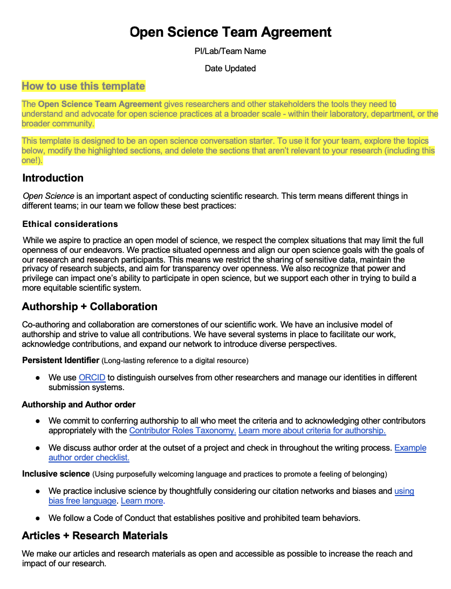

::: questions
-   What is the Open Science Team Agreement?
-   How can librarians use it?
:::

::: objectives
-   Discuss the role and the benefits of lab manuals and agreements
-   Describe how the Open Science Team Agreement can be used to explain
    open science concepts
:::

## Introduction: What is open science?

**Open science** is the principle and practice of making research
products and processes available to all, while  

-  respecting diverse cultures, 
-  maintaining security and privacy, and 
-  fostering collaborations, reproducibility, and equity. 

Source: [NASA Transform to Open Science](https://nasa.github.io/Transform-to-Open-Science/what-is-open-science/)

**In practice,** open science requires cultural change at the
organizational level, within lab groups, and for individuals.

Open science offers opportunities for librarians, research data managers
and [other roles] to engage in outreach and instructional activities to
assist with this transition.

## Foundation: Lab Manuals

Many researchers use lab manuals as documents that outline practices,
techniques and institutional knowledge for students and researchers in a
laboratory setting. They also act as a compact or agreement that makes
group norms and expectations transparent.

Examine the examples below to get a sense of what is included in a lab
manual.

For more lab manual examples:

-   [Fraser Lab Compact and
    Philosophy](https://fraserlab.com/philosophy/)
-   [Fay Lab Manual](https://thefaylab.github.io/lab-manual/)
-   [Benjamin-Chung Lab Manual](https://jadebc.github.io/lab-manual/)
-   [CCT-Data Science Team Protocols](https://osf.io/tzmhp/wiki/home/)

::: instructor

We recommend putting the links in the chat for learners to review.

:::

::: challenge
## Challenge 1: Lab Manuals (5 min)

What are 3 topics that a researcher team might include in their lab
manual?

::: solution
## Answer

Possible Answers include:

-   Best practices for presentations
-   Conflict of interest statement
-   Code of conduct
-   Communication tools
-   Authorship practices
-   File management practices
-   Data storage recommendations
-   Lab values
-   University policies
:::
:::

## Open Science Team Agreement

Inspired by lab manuals, the [Bay Area Open Science
group](https://bayareaopensciencegroup.github.io/) created this open
science team agreement to codify a commitment to certain research
practices. Intended for collaborations of any size, the Open Science
team agreement allows group members to start conversations, learn about
open science and commit to new open practices. Groups can return to and
revise the agreement at regular intervals as needed. We recommend
creating the team agreement for a new project or team.

{width=300px}

The Open Science Team Agreement template includes brief explanations of
key open science topics, practices and products that group members might
like to discuss, learn about and adopt including:

| Topic                           | Sub-topic                                                                                                   |
|------------------------------------|------------------------------------|
| Authorship and collaboration    | Persistent Identifiers, Author order, and Inclusive Science                                                 |
| Articles and research materials | Preregistration, Methods and Protocols, Preprints, Open Access, Theses and Dissertations, and Presentations |
| Data and code                   | Documentation, Data, Software and Code                                                                      |
| Communication and Impact        | Copyright, Research Profiles, Social Media                                                                  |

Within those categories the template offers suggestions for products and
services that address specific workflow needs.

::: challenge
## Challenge 2: Team agreements (5 min)

Which of the following statements about team agreements are true?

1.  Team agreements require a team of 10 or more
2.  Team agreements are updated once and then archived
3.  Team agreements are living documents

::: solution
## Answer

3.  Team agreements are living documents
:::
:::

:::::: challenge

## Optional Discussion (10 min)

How does a Lab Manual and an Open Science Team Agreement differ?

::: hint
## Hints

- A Lab Manual is a broader, foundational document that also covers university policy, employment details, lab safety, equipment access 
- An Open Science Team Agreement might live within a Lab Manual An Open Science Team Agreement is specific to open science practices and workflows 
- An Open Science Team Agreement might be adopted by a group of collaborators from different labs or different institutions.

:::
::::::

::: keypoints
- The Open Science Team Agreement gives researchers and other stakeholders the tools they need to understand and advocate for open science practices within their laboratory, department or the broader community.
- Open Science Team Agreement are living, editable documents.
- Librarians can use the Open Science Team Agreement to start conversations with their research groups and departments.
:::
